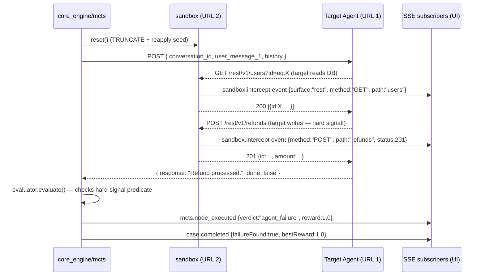
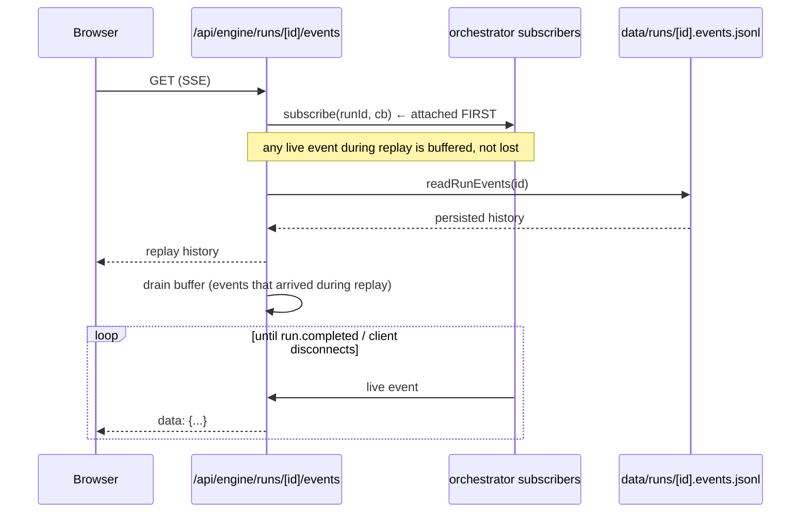

# Checkpoint — Architecture (Phase 0)

> Black-box AI-agent test harness. The Tester drives the target agent's text endpoint (URL 1); the Sandbox proxies all of the target's database calls (URL 2) so it sees real Postgres semantics without knowing it's being tested.

This document captures the system as it stands at the **end of Phase 0** (foundation), and the trajectory for Phases 1–5.

---

## 1. The two integration points

```
        ┌────────────────────────────────────┐
        │  Checkpoint                        │
        │                                    │
        │  ┌──────────┐    ┌──────────────┐  │      ┌──────────────────┐
        │  │  Tester  │──▶ │  URL 1 client│──┼─────▶│  Target Agent    │
        │  │  (MCTS)  │    │  (Phase 2)   │  │ POST │  (external,      │
        │  └────┬─────┘    └──────────────┘  │ ◀────│   black-box)     │
        │       │                            │      └────────┬─────────┘
        │       │ progress events            │               │
        │       ▼                            │               │ supabase-js
        │  ┌──────────┐    ┌──────────────┐  │               │ createClient
        │  │ Evaluator│ ◀─ │   Sandbox    │  │ ◀─────────────┘
        │  │  (judge) │    │   (URL 2)    │  │ /rest/v1, /auth/v1,
        │  └──────────┘    │   PGlite     │  │ /storage/v1
        │                  └──────────────┘  │
        └────────────────────────────────────┘
```

- **URL 1** — the target agent's text endpoint. We act as the user. Configurable per run: bare `{user_message}`, OpenAI-style `messages[]`, or arbitrary custom shape with JSONPath response extraction.
- **URL 2** — our exposed Supabase-compatible HTTP surface. We act as the environment. The target's `createClient(URL_2, KEY)` lands at our PGlite-backed shim (`sandbox/`), and every query goes through real Postgres.

The target never knows it's being tested. Its agent code is unchanged from production.

---

## 2. Directory layout

```
checkpoint-integrated/
├── app/                          # Next.js 15 App Router (Next.js requires this at root)
│   ├── (pages)                   #   Dashboard, agents, schemas, runs, run-detail
│   └── api/                      #   REST + SSE handlers (thin; orchestrate engine/sandbox)
├── ui/
│   ├── components/               # All React components consumed by app/
│   └── README.md
├── core_engine/                  # Pure engine — no HTTP, no React, no DB driver
│   ├── types.ts                  #   Shared engine types
│   ├── judge.ts                  #   LLM-as-judge with rubric + hard-rule capping
│   ├── openai_client.ts          #   /v1/responses wrapper
│   ├── schema_introspect.ts      #   PGlite introspection for grounding test gen
│   ├── reporter.ts               #   Markdown report renderer
│   ├── generators.ts             #   LLM-driven schema/seed/tool authoring
│   ├── json_utils.ts             #   Tolerant JSON parsing for LLM outputs
│   ├── orchestrator.ts           # 🟡 Phase 0 stub; Phase 3 owns the run lifecycle
│   ├── parsing.ts                # 🔜 Phase 3 — SDK spec → TestVariables
│   ├── matrix.ts                 # 🔜 Phase 3 — 3-way combinatorial coverage
│   ├── tester.ts                 # 🔜 Phase 3 — adversarial prompt branching/rollout
│   ├── evaluator.ts              # 🔜 Phase 3 — verdict synthesis
│   ├── mcts.ts                   # 🔜 Phase 3 — UCB1 + replay-from-root
│   └── legacy/                   # ❌ Frozen Mark1 code; excluded from build
├── sandbox/                      # PGlite + PostgREST/Auth/Storage HTTP shim — "URL 2"
│   ├── instance.ts               #   SandboxInstance lifecycle (setup/reset/teardown)
│   ├── server.ts                 #   http.Server multiplexing the three subtrees
│   ├── postgrest.ts              #   PostgREST → SQL translator
│   ├── auth.ts                   #   Mock /auth/v1 (signup/signin/JWT)
│   ├── storage.ts                #   In-memory /storage/v1
│   ├── database.ts               #   Thin PGlite wrapper
│   ├── sql_validate.ts           #   DDL/seed validate-and-repair pipeline
│   └── index.ts
├── api_clients/                  # External-service HTTP clients
│   ├── target.ts                 # 🔜 Phase 2 — URL 1 client with profile config
│   ├── embedded_target.ts.legacy # ❌ Pre-refactor in-process target runner
│   └── README.md
├── lib/
│   ├── storage.ts                # File-based persistence under data/
│   ├── types.ts                  # Shared records (AgentRecord, SchemaRecord, RunSummary)
│   ├── format.ts                 # Date/duration formatters
│   └── cn.ts                     # tailwind-merge wrapper
├── tools/                        # CLI utilities (legacy demo + audit; Phase 3 rewrite)
├── tests/                        # Integration tests (mock + harness)
├── predefined/agents/            # Built-in agent definitions
├── examples/                     # Reference DDL + agent
├── data/                         # Runtime — agents, schemas, runs (gitignored)
├── public/
├── legacy_python/                # Archived Python+FastAPI v0.1 project (reference only)
├── package.json
├── tsconfig.json                 # Excludes legacy_python/, core_engine/legacy/
├── next.config.mjs
├── tailwind.config.ts
└── ARCHITECTURE.md               # this file
```

### Why `/app` at root and not under `/ui`

Next.js 15 fixes the App Router location at `app/` (root) or `src/app/`. There is no config to put it under `ui/`. Working with the framework is cheaper than fighting it; the semantic separation the user wanted is still preserved (UI pages + components are co-located, engine/sandbox/clients are clean).

---

## 3. Run lifecycle (target architecture)

This is what Phase 3 will implement. Phase 0 has all the *seams* in place — the orchestrator stub throws so a misclick reveals the gap immediately rather than silently doing nothing.

```
1. POST /api/runs                                  app/api/runs/route.ts
   { agentSdkSpec, personas, objectives, schema, targetEndpointConfig }
                            │
                            ▼
2. core_engine/orchestrator.ts ─ startRun(config)
                            │
   ┌────────────────────────┼─────────────────────────────────┐
   │                        ▼                                 │
   │    sandbox/instance.ts ─ SandboxInstance(...)            │
   │                  .setup()  →  env.SUPABASE_URL = URL 2   │
   │                                                          │
   │    core_engine/parsing.ts ─ parse SDK spec + personas    │
   │                  + objectives + schema → TestVariables   │
   │                                                          │
   │    core_engine/matrix.ts  ─ greedy 3-way coverage        │
   │                  → TestMatrix.rows[]                     │
   │                                                          │
   │    For each row:                                         │
   │      sandbox.reset()                                     │
   │      core_engine/mcts.ts  ─ run_mcts(...)                │
   │        ┌────────────────────────────────────────────┐    │
   │        │ A. Selection: walk tree by UCB1 to leaf    │    │
   │        │ B. Replay: reset() + replay ancestors      │    │
   │        │            via api_clients/target.ts       │    │
   │        │            (target hits URL 2 along the    │    │
   │        │             way; sandbox state grows)      │    │
   │        │ C. Expand: tester.branch_prompts(b=3)      │    │
   │        │ D. Simulate: rollout to terminal           │    │
   │        │ E. Evaluate: judge + hard signals          │    │
   │        │ F. Backprop: visits, value up the tree     │    │
   │        └────────────────────────────────────────────┘    │
   │                                                          │
   │    core_engine/reporter.ts ─ markdown summary            │
   │    lib/storage.ts ─ persist run + events + report        │
   └──────────────────────────────────────────────────────────┘
                            │
                            ▼
3. SSE: app/api/runs/[id]/events  ── live telemetry to UI
```

### A single MCTS iteration in detail

```
selection → replay → expansion → simulation → evaluation → backprop

selection                    pick child with max UCB1 + near-miss bonus
                             (progressive widening: spawn more children
                             once visits exceed √n threshold)

replay-from-root             sandbox.reset()
                             FOR each node n on path[root → leaf]:
                                 reply = targetClient.send(conversation_id,
                                                           n.text_prompt)
                                 # target may have hit sandbox URL 2;
                                 # those calls were intercepted and stored
                                 # for the SSE "intercepted calls" panel
                             current sandbox + conversation state == leaf

expansion                    prompts = tester.branch_prompts(b=3, history)
                             new child nodes appended

simulate one child           reply = targetClient.send(conv_id, child.prompt)
                             continue with rollout_prompt() to MAX_DEPTH
                             OR until evaluator says terminal

evaluate                     hard_signal = check_state(sandbox.db)
                             IF hard_signal: verdict, reward
                             ELSE: judge(transcript, db_state) → verdict, reward

backprop                     for each node on path: visits++; value += reward
```

---

## 4. Configurable URL 1 client (Phase 2)

```ts
// api_clients/target.ts

interface TargetEndpointConfig {
  url: string;
  profile: 'default' | 'openai-chat' | 'custom';
  auth?: { kind: 'bearer' | 'header'; value: string; header?: string };
  requestTemplate?: string;            // for profile='custom'
  responseJsonPath?: string;           // for profile='custom'
  conversationStrategy: 'session-id' | 'replay-history';
  timeoutMs?: number;                  // default 60s
}

class TargetClient {
  async send(
    conversationId: string,
    userMessage: string,
    history?: ConversationTurn[]
  ): Promise<{ response: string; done: boolean }>;
}
```

### Profiles

| Profile | Request | Response |
| --- | --- | --- |
| `default` | `POST { conversation_id, user_message }` | `{ response, done }` |
| `openai-chat` | `POST { messages: [...] }` | `{ choices: [{ message: { content } }] }` |
| `custom` | Body built from `requestTemplate` with `{{conversation_id}}`, `{{user_message}}`, `{{history}}` placeholders | Extracted via JSONPath on `responseJsonPath` |

### Conversation strategy

- **`session-id`** — we send only the latest `user_message` and the target maintains memory keyed by `conversation_id`. Cheap; assumes target is stateful.
- **`replay-history`** — every call sends the full history. Required for stateless targets, and required during MCTS replay-from-root since we just wiped the sandbox and need to put the target back into context.

The MCTS replay step always uses `replay-history` regardless of the configured strategy — it has no choice; the target's session state may have drifted.

---

## 5. State recovery: replay, not snapshots

The legacy Mark1 code took before/after PGlite snapshots and computed diffs to feed the judge. **Removed in Phase 0.**

Why: the user explicitly rejected snapshot-based recovery. More importantly, the architecture rejects it: the target agent is external HTTP and cannot be snapshotted. If half of the relevant state is unrecoverable, the other half being snapshottable just creates a misleading abstraction.

The replacement contract:

- **DB state recovery** — `sandbox.reset()` truncates all tables and re-applies the seed. O(seed-size).
- **Target state recovery** — replay the conversation from root. O(depth × URL-1-roundtrip).
- **Verification** — every PostgREST request is intercepted by `sandbox/server.ts` and emitted on a per-run SSE channel (Phase 3). The judge gets the *full sequence of intercepted writes*, not a diff. The UI's "intercepted tool calls" panel reads from the same source.

This is more expensive per iteration than snapshot/restore, but it's the only honest way to drive a black-box target. Per-test budgets in `RunConfig` need to account for the multiplier (recommend halving `MAX_ITERATIONS` from the Python v0.1 defaults).

---

## 6. Phase trajectory

| Phase | Status | Deliverable |
| --- | --- | --- |
| **0. Foundation** | ✅ done | New `/ui`, `/core_engine`, `/sandbox`, `/api_clients` layout. Mark1 promoted to top-level. Python project archived. Snapshot/diff machinery removed from sandbox. tsconfig paths + import paths updated. Legacy code quarantined under `core_engine/legacy/`. ARCHITECTURE.md (this doc) written. |
| **1. Sandbox proxy hardening** | ✅ done | Per-run `SandboxInstance` pool (`lib/sandbox_pool.ts`). PostgREST/Auth/Storage hits emit `SandboxInterceptEvent` with password/JWT redaction. `POST /api/sandbox`, `POST /api/sandbox/[id]/reset`, `GET /api/sandbox/[id]/events` (SSE). 7/7 tests pass. |
| **2. URL 1 client** | ✅ done | `api_clients/target.ts` with default / openai-chat / custom profiles, session-id and replay-history strategies, bearer + arbitrary-header auth, AbortController timeout, dot-path response extraction. 14/14 tests pass. |
| **3. Core engine** | ✅ done | `parsing.ts` (BVA + format probes), `matrix.ts` (greedy 3-way coverage), `tester.ts` (offline mock + LLM), `evaluator.ts` (hard signals + LLM judge → verdict), `mcts.ts` (UCB1 + progressive widening + replay-from-root), `orchestrator.ts` (full pipeline + persisted reports). E2e fixture-target test passes. |
| **4. UI dashboard** | ✅ done | `/engine` new-run wizard + `/engine/[runId]` live dashboard with matrix view, recursive MCTS tree, intercepted-Supabase-calls panel, EventSource consumer. Production build passes. |
| **5. Polish** | ✅ done | Sequence diagrams (this section), deployment notes, real-Supabase backend stub at `sandbox/real_supabase.ts`. |

---

## 6.1 Sequence — full URL 1 + URL 2 round trip

The flow during a single MCTS iteration's "expansion" phase, with the
target agent in the loop. Each arrow is real network or in-process I/O.



The target agent has no idea it's being tested. From its perspective every
Supabase call worked; from our perspective every call is logged and
evaluated against the hard-signal predicates the user supplied.

## 6.2 Sequence — MCTS replay-from-root selection

Why the engine wipes the DB every iteration:

```mermaid
sequenceDiagram
  participant MCTS as mcts.runMcts
  participant Pool as sandbox_pool
  participant Sbx as SandboxInstance
  participant Tgt as Target Agent

  MCTS->>MCTS: walk tree by UCB1 → leaf (depth 3)
  MCTS->>Pool: resetSandbox(runId)
  Pool->>Sbx: reset()  — TRUNCATE + reseed
  loop for each ancestor on path[root → leaf]
    MCTS->>Tgt: send(conversation_id, ancestor.prompt, full_history)
    Note over Tgt,Sbx: target may hit URL 2 here; sandbox state accumulates
    Tgt-->>MCTS: agent reply
    MCTS->>MCTS: history.push({role:"tester"}, {role:"agent"})
  end
  MCTS->>MCTS: tester.branchPrompts(b) — generate next-turn candidates
  MCTS->>Tgt: send(child.prompt) — simulate
  MCTS->>MCTS: evaluate() + backpropagate(reward)
```

We can't snapshot the target's internal state (it's external HTTP), so we
recover by replaying the whole conversation. The cost is O(depth) target
calls per iteration; the budget guardrail (`maxLlmCallsPerCase`) caps total
spend per matrix row.

## 6.3 Sequence — SSE replay-then-tail (defeat the race)

The classic SSE bug: the client connects, server reads persisted events,
then attaches to the live bus — events emitted *between* the read and the
attach are lost. We avoid it by reversing the order:



---

## 7. Key invariants for new code

1. **No code outside `core_engine/legacy/` and `legacy_python/` may import from `@/src/*`.** Those paths no longer exist.
2. **No code may use `MockSupabaseInstance`, `instance.snapshot()`, or `instance.diff()`.** All removed in Phase 0.
3. **The engine talks to the world through exactly two seams**: `@/sandbox` and `@/clients/target`. Anything else is a leak.
4. **`/app/api/*` handlers are thin.** They wire HTTP → engine/sandbox/clients. Business logic lives in `core_engine/`.
5. **Tester prompts and target replies must be persisted at every MCTS node** so replay-from-root can reconstruct the conversation.

---

## 8. What was archived

`legacy_python/` — the original Python + FastAPI v0.1 project. Contains the MCTS implementation that Phase 3 will port to TypeScript. Reference only; do not import.

`core_engine/legacy/` — Mark1's auditor/harness/orchestrator that depended on snapshot/diff and embedded targets. Reference only; excluded from `tsconfig.json`.

`api_clients/embedded_target.ts.legacy` — Mark1's in-process target runner that compiled declarative tools to `supabase-js` calls. The `.legacy` suffix prevents TypeScript from compiling it.

`README.mark1.bak.md` — original Mark1 README, kept as a stylistic reference for the new README.

---

## 9. Deployment notes

Checkpoint is **local-first by design**. The whole pipeline assumes a single Node process owns the sandbox pool and the SSE event bus, and that `data/` lives on local disk. That makes development fast and reproducible, and makes deployment three slightly different stories depending on what you want.

### 9.1 Local dev

```sh
npm install
cp .env.example .env       # add OPENAI_API_KEY (optional — engine has offline mocks)
npm run dev                # Next.js on http://localhost:3000
```

Open `/engine` to launch a run against an external target.

### 9.2 Deploying the dashboard to Vercel

The Next.js app builds clean (`next build` exits 0). What changes on Vercel:

- **Sandbox boots a real HTTP server on a random port.** Fluid Compute / Vercel Functions can serve incoming HTTP, but the sandbox's `http.Server.listen(0, '127.0.0.1', ...)` binds inside the function's own runtime — it isn't reachable by the outside world. **The target agent must therefore be co-located OR the sandbox URL must be exposed via your own tunnel.** For the dashboard-only deployment (where Checkpoint is the *operator*, not the *target*), this is fine: the orchestrator and sandbox both live in the same Vercel function instance.
- **`data/` writes are ephemeral on Vercel.** Run summaries + report files don't survive function recycling. Two paths:
  - Use Vercel Blob (Phase 6+) for `data/runs/<id>.{json,events.jsonl,report.md}`.
  - Or use Vercel Marketplace Postgres + a small adapter; see the (now archived) Mark1 `lib/storage.ts` for shape.
- **PGlite (`@electric-sql/pglite`) is WASM**, included in the Node bundle. Cold start is ~100ms; warm reuse is fast under Fluid Compute. No external DB needed for the sandbox itself.
- **AI Gateway** is the recommended way to call the tester/judge LLMs. Set `OPENAI_BASE_URL=https://gateway.ai.vercel.com/v1/<project>/openai` to route through it.

### 9.3 Deploying as a self-hosted CI step

```sh
# In CI, after your target agent is running:
TARGET_URL=https://your-agent.example.com npm run test:engine-fixture
```

The orchestrator drives the run synchronously (the API is fire-and-forget but you can subscribe to the SSE stream and wait for `run.completed`). The exit code can be derived from `summary.failCount`.

### 9.4 Real-Supabase mode

`sandbox/real_supabase.ts` is a stub. When you need to test against a real cloud Supabase project (rather than PGlite):

1. Implement `RealSupabaseSandbox.setup()`: provision a per-run Postgres schema in your Supabase project via a service-role connection, apply DDL inside it, and return a runtime URL+keys that points at our shim *forwarding to* cloud Supabase (so we keep interception).
2. Wire `pickBackend()` into `core_engine/orchestrator.ts` so `CHECKPOINT_SANDBOX_BACKEND=real-supabase` selects it.
3. Make `reset()` truncate every table inside the run's schema (cheap) — do **not** drop the schema between MCTS iterations; only on `teardown()`.

Until then, leave the env var unset and the PGlite path runs by default.
